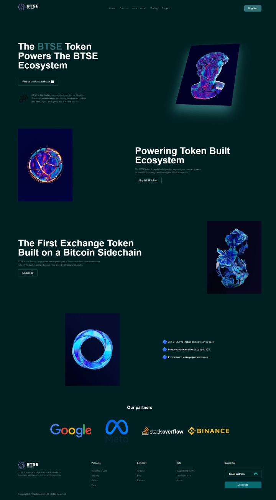

# btse-token
My first standalone HTML/CSS project. Based on inspiration design found on Dribble. 

Layout and project idea was taken from inspiration design on Dribble. (Credit: Arafat - UI/UX) 
Images taken from Unsplash. (Credit: Simon Lee)

Design isn't copied fully, because I didn't have access to UI design files or images/icons from original design.

Timeframe: 5-6 hours

## Learned:

- Flexbox
- CSS Grid
- Transformation(Buttons)
- Rotations (3D effects)

### Built With

* ![HTML][HTML]
* ![CSS][CSS]

### Preview

  

<!-- MARKDOWN LINKS & IMAGES -->
[HTML]: https://img.shields.io/badge/-HTML-E34F26?logo=html5&logoColor=white&style=for-the-badge
[CSS]: https://img.shields.io/badge/-CSS-1572B6?logo=css3&logoColor=white&style=for-the-badge
